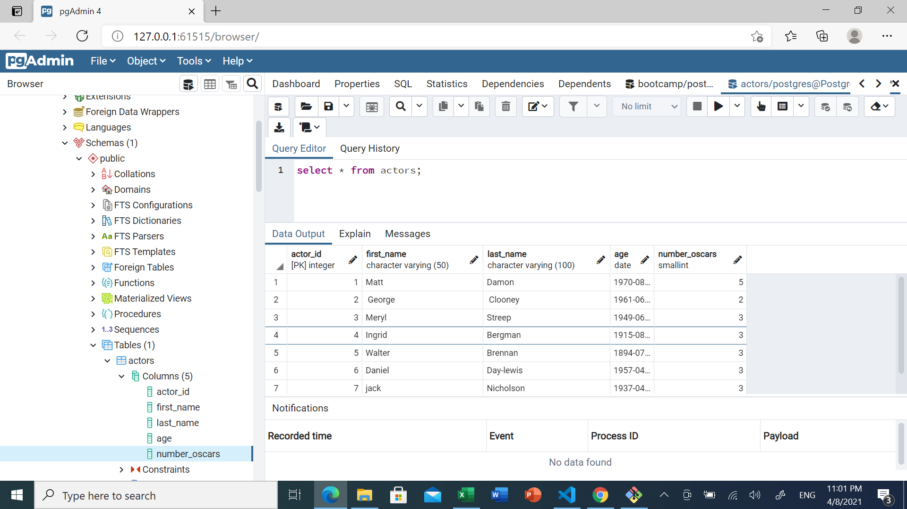
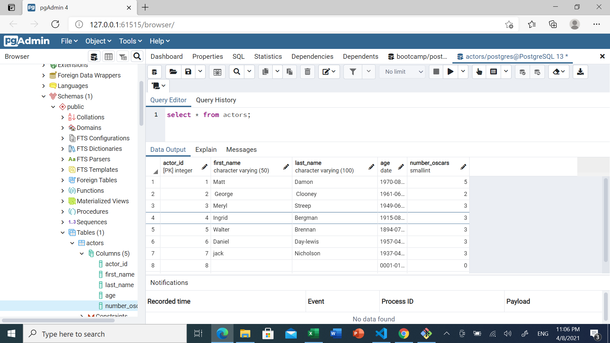

## Amount of actors 7

## Only was able to add an empty value in the strings, the date had to be at least something and the number put it to 0. 

Wasnt shure if the assigment have to be done in a .py file. but we still didnt learn how to connect acttualy this postrgress databases with the code. if not i will be doing the excercise again.
